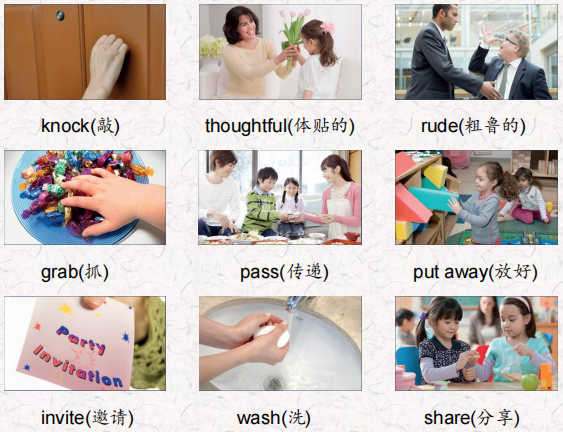
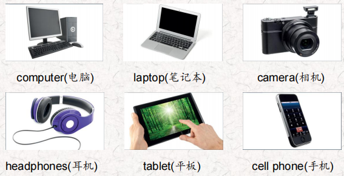
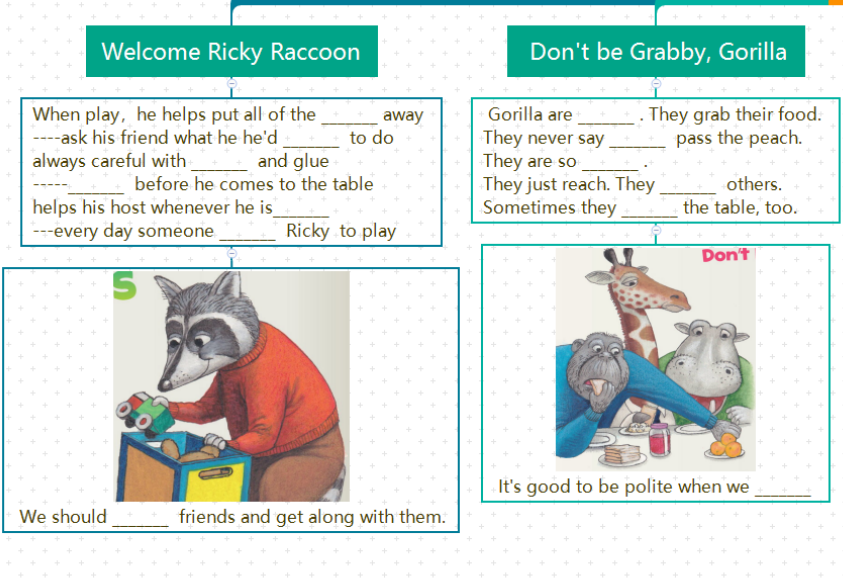
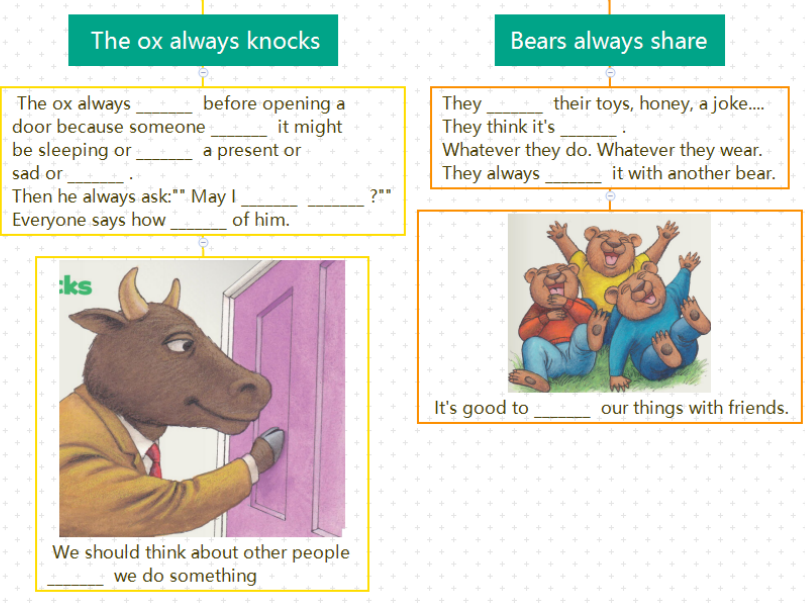
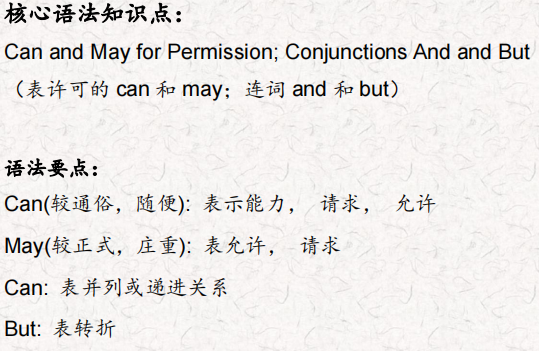
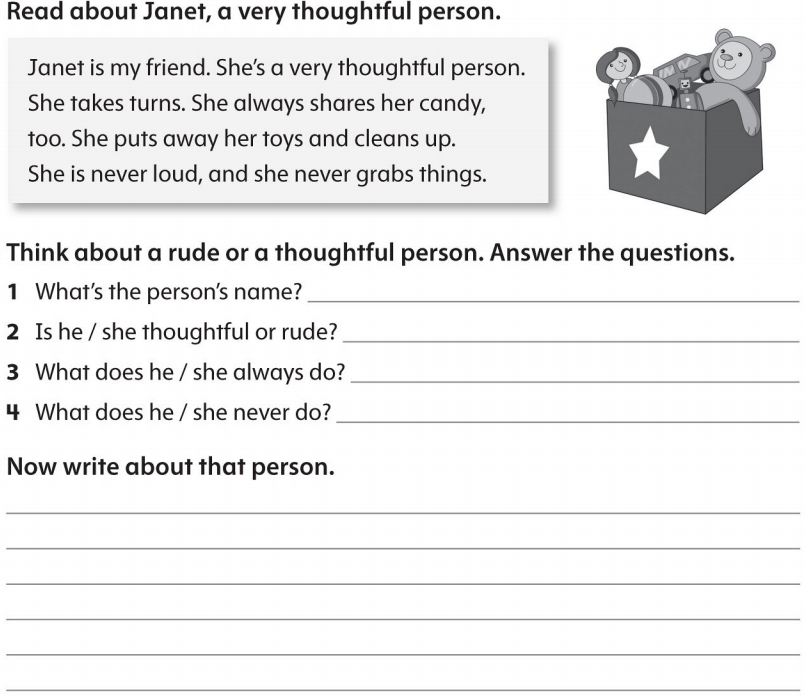

# OD2-Unit10 知识清单

| 上课内容 | Unit9 The Please and Thank You Book Poems | 学习目标 |
| --- | --- | --- |
| 单词 |  | 会听、会说、会读、会默写 |
| 短语 | would like to do 想要做某事 be carefull with… 对…小心 share with 分享 | 短语会造句 |
| 阅读技巧 | The theme of a story is the most important thing the writer wants you to understand. The writer is often showing something important. 故事的主题是作者想让你理解的最重要的东西。作者经常展示一些重要的东西。 |  |
| 重点句型 | When Ricky Raccoon comes over to play, He helps put all of the foys away. 当Ricky浣熊过来玩的时候，他帮着把所有的狐狸都放好了。 He asks his friend what he'd like to do. 他问他的朋友他想做什么。 And is always careful with scissors and glue. 而且总是小心地使用剪刀和胶水。 He washes before he comes to the table. 他洗漱后才进餐。 And helps his host whenever he's able. 只要有机会就会帮助主人。 That's why almost every day invites Ricky over to play! 这就是为什么几乎每天都邀请里奇过来玩! The ox Always knocks Before Opening a door. 牛总是先敲门再开门。 Because Someone behind it Might be sleeping Or wrapping a present, Or sad or weeping. 因为背后的人可能在睡觉或者在包装礼物，或者悲伤或者哭泣。 How thoughtful of him! 他想得真周到! Bears share a joke They think is funny: 熊分享一个他们认为很有趣的笑话: Whatever they do. Whatever they wear. They always share it with Another bear. 不管他们做什么。不管他们穿什么。它们总是和另一只熊一起吃。 |  |
| 听力 | 听力词汇：  听力原文： One. Hey! I'm using the tablet now. Well, I need it now. You don't need it! You're playing games. Well, you're just looking at the Internet. Use the laptop for that. I'm doing homework. Give it back to me now! Mom! Two. May I borrow your cell phone? Mine's not working Of course. Here you are Thank you. No problem. Three. Oh, no. I don't know how to use this desktop computer I can show you. lt's easy. Really? Thanks! See, this is how you do it. Now you try! Hey! I can do it. Four. Can you give me my headphones back? Sorry. I can't find them, I don't know where they are. Really? But I want them back! I think my little brother has them. He put them in the bathtub with your camera. That's not OK! You can never use my things again. | 每天听+跟读 |
| 口语 | Being Polite  讲礼貌 Are you using that computer? 你在用那台电脑吗? Yes, l am. But we can share.是的，我是。但是我们可以分享。 Great. Thanks.，太好了，谢谢。 |  |
| 复述课文 |   | 根据关键字提示复述课文复述 |
| 语法 |  |  |
| 写作 |  | 仿写 |
