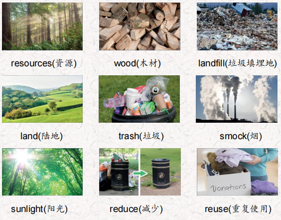
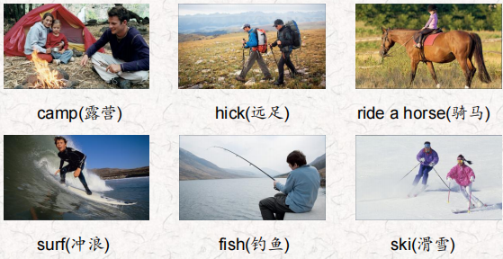
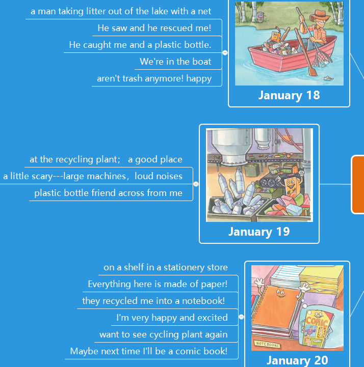
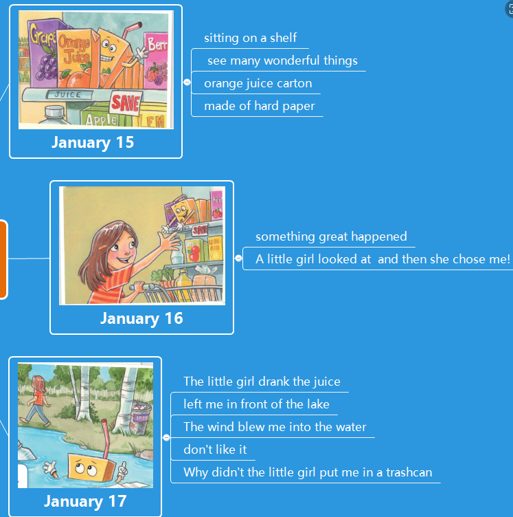
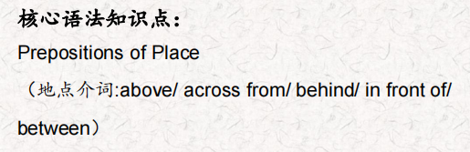
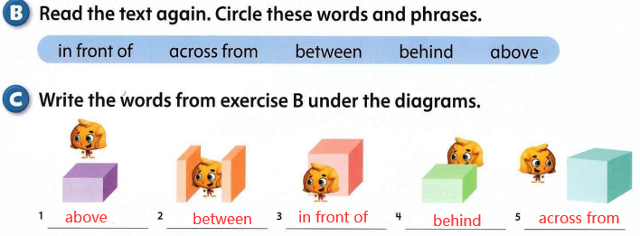
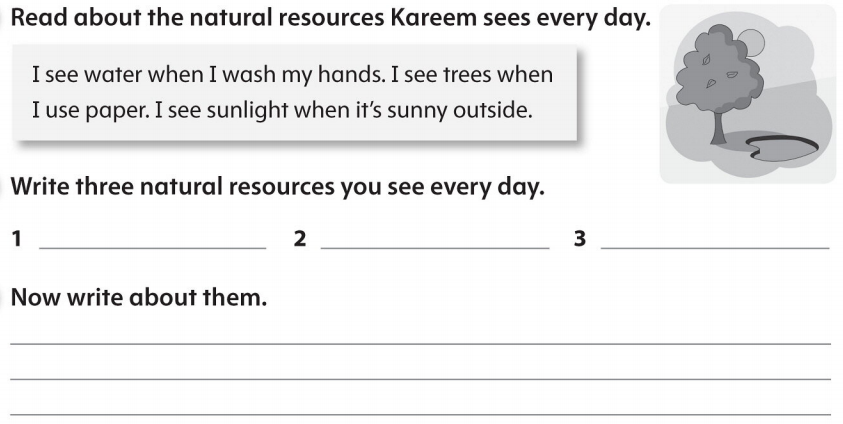

# OD2-Unit11 知识清单

| 上课内容 | Unit11 Natural Resources | 学习目标 |
| --- | --- | --- |
| 单词1 |  | 会听、会说、会读、会默写 |
| 短语 | take care of 照顾 plastic drink bottles 塑料饮料瓶 Make from 由什么制成 throw away 扔掉 | 短语会造句 |
| 阅读技巧 | Remember, the main idea is what a text is about. The main idea is often the first sentence in a text. Details tell us more about the main idea. 记住，文章的主旨是关于什么的。文章的中心思想通常是文章的第一句话。细节说明了更多的主要思想。 |  |
| 重点句型 | Living things need clean air to breathe and clean water to drink.生物需要呼吸干净的空气，喝干净的水。 We shouldn't hurt our natural resources because we can't usually make more of them.我们不应该伤害我们的自然资源，因为我们通常不能制造更多的资源。 If the air is dirty, people can get sick and plants can't grow. 如果空气脏了，人们就会生病，植物就不能生长。 Trash is very bad for our natural resources.垃圾对我们的自然资源非常有害。 People can't use that land, and farmers can't grow food on it.人们不能使用这些土地，农民也不能在上面种植粮食。 We can all take care of the Earth's resources. 我们都可以照顾地球的资源。 Use things until you can't use them anymore.使用一些东西，直到你再也不能使用为止。 Don't throw things away. 不要乱扔东西。 Reuse them. 重用它们。 Refill plastic drink bottles.重新填充塑料饮料瓶。 Make toys from old things.用旧东西做玩具。 Reduce the natural resources you use. 减少自然资源的使用。 Take your own bag to the store.把你自己的包带到商店去。 |  |
| 听力 | 听力词汇：  听力原文： One. Are you ready, Callie? Hurry up and get your fishing pole! Let's go! OK, OK I'm coming. Eeewww! Michael, look at all that trash in the water! Oh, no! We can't fish now. It's dirty! We don't want to get sick. Yeah, let's go home. Two. It's a beautiful day in the mountains. Lots of sunlight, blue sky and ... ... a lot of snow! lt's great weather to ski. And it's so beautiful here. Look at the snow on the trees in the woods in front of the mountain. The trees, the animals and the snow are just lovely. It's great. Dad! Look at the rabbit between the trees! We don't see any rabbits at home. You're right The air is so clean here, too. The air at home in the city is dirty. Are you ready to ski down this mountain, Amelia? Yes, Dad, let's go! Three. OK, Colin. Let's take the horses over to that field behind the barn. Sure, Grandpa. Then can we ride the horses? Let's see if the field is clean now. There was a lot of litter in that field. Oh, no! Then we can't ride the horses! I think it's OK Yes! Look! They cleaned it up! Yes! Can I ride the big one, Grandpa? Four. Here we are, kids. Let's take everything out of the car. This is exciting. lt's fun to camp. Wait a minute, Mom, What's that? Above the trees? It looks like smoke. Let's go look. Yuck! What a mess! People were cooking here. There's trash everywhere! Yes, and the air doesn't smell good. I'm sorry, kids. We better go home. AwWW... Five. Are you ready? Yes, I have my new hiking boots on. OK, we're almost at the park. Here we are. Oh! Do you smell that? Yes, it's awful! I can't hike! I can't breathe! The air is really bad here. There are too many cars and trucks on the road in front of the park. It's not healthy. Yeah, let's go. Six Get your things, Nathan. Let's go look at the water! Wow! The water is beautiful, Dad. I can see the bottom! Yes, the water at this beach is very clean. I can see a fish between those two seashells! Dad, can we surf now? Please? Wait one minute, Nathan. Let me get ready. OK, let's go! Yeah! This is fun! | 每天听+跟读 |
| 口语 | Reprimanding and Apologizing训诫与道歉 Please don't litter. Use the trash can.请不要乱扔垃圾。使用垃圾桶。 Sorry. Where is it? 对不起，它在哪里? It's in front of that tree.它在那棵树的前面。 Oh, I see it. Thanks.哦，我看到了。谢谢。 |  |
| 复述课文复述 |   | 根据关键字提示复述课文复述 |
| 语法 |   |  |
| 写作 |  | 仿写 |
