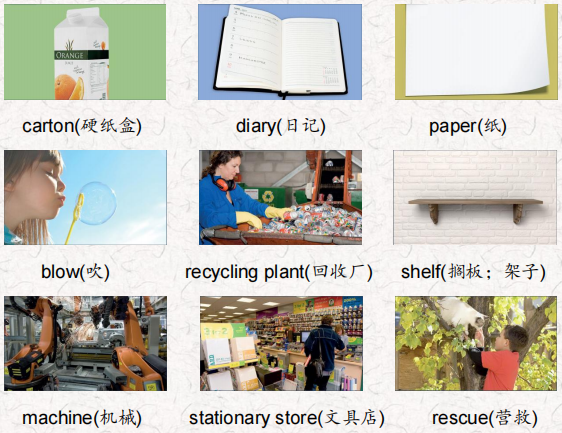
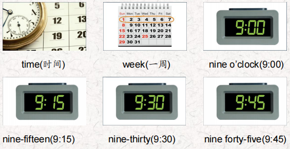
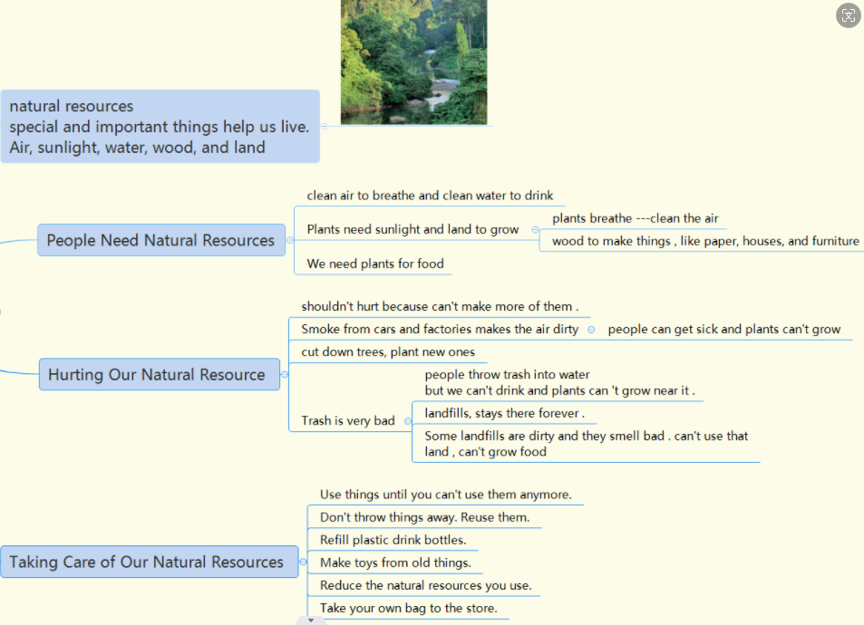
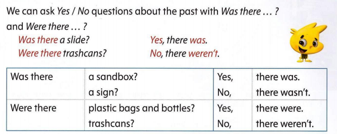
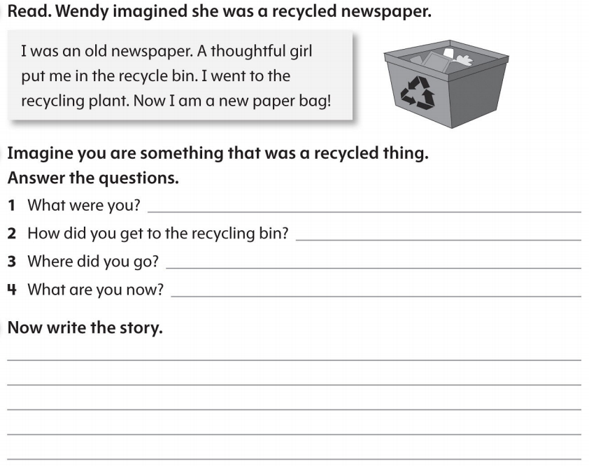

# OD2-Unit12 知识清单

| 上课内容 | Unit12 A Juice Carton's Diary | 学习目标 |
| --- | --- | --- |
| 单词 |  | 会听、会说、会读、会默写 |
| 短语 | in front of… 在…的前边 comic book连环漫画册 next time 下次 | 短语会造句 |
| 阅读技巧 | Setting is the place where the story happens. It answers the question Where? Knowing where the story takes place helps you understand more about the story! 背景是故事发生的地方。它回答了在哪里的问题?知道故事发生的地点可以帮助你更好地理解故事 |  |
| 重点句型 | I'm sitting on a shelf in a big store! 我正坐在一家大商店的架子上! The little carton in front of me has a picture of an orange on it. 我面前的小纸盒上有一个橘子的图片。 I'm made of hard paper.我是硬纸做的。 This morning something great happened. 今天早上发生了一件大事。 She's taking me to a picnic by the lake so I hope she's very thirsty.她要带我去湖边野餐，所以我希望她很渴。 The wind blew me into the water.风把我吹进了水里。 There was a trashcan behind the tree.树后面有一个垃圾桶。 I saw a man taking litter out of the lake with a net. 我看见一个人用网从湖里捞垃圾。 we aren't trash any more!我们不再是垃圾了! He's across from me. 他在我对面。 Maybe next time I'll be a comic book!也许下次我会是一本漫画书 |  |
| 听力 | 听力词汇：  听力原文： One. Hello? Hi, Lucas! This is Grandma. Are you Ok? Hi, Grandma. Yeah, I'm fine. I'm just very tired. (SFX: Lucas yawning) Tired? it's only 7:00! Why are you so tired? Because today is Earth Day, Grandma, and we were very busy at school. Tell me about it. We picked up a lot of trash behind the school. But it didn't take too much time. Two. Well, that was a good thing to do. Yes, and we visited the recycling plant. We saw them recycle plastic cartons. Well. that sounds interesting. That was at 9:30 in the morning? No, that was at 9:15 Three. Was that all? Oh, no. We reused glass jars and milk cartons and made them into a container for pens and pencils. Mine is purple and black. We did that at 10:00. Sorry, Lucas did you say 10:45?No Grandma I said 10:00.1 can make one for you too. That's lovely, Lucas! Four. After lunch at 1:45, we walked to the park It took about 15minutes. Then we cleaned up the park. That took a lot of time! I'm sure it did. Was it very dirty? Yes, it was. We were there a long time. Well, that was a very nice thing to do for the town. Five. Each class from our school planted a tree in front of the park. It was fun. That was at 2:00. The principal came, too. That was at 3:00? No, Grandma. 2:00.(SFX: yawning again) It was a lot of hardwork! Six And was that all? No! I forgot! We had a toy and book give away, too! We brought our old toys and books in for the little kids. That was at 2:30. Good for you! Now I know why you're so tired. I think you should go to bed now, Lucas. You're right, Grandma. See you next week! Bye. Bye-bye! | 每天听+跟读 |
| 口语 | Describing conservation activities 描述环保活动 I recycled my milk cartons. Did you? 我回收牛奶盒的环保活动。你呢? Yes, I did. I recycled my milk cartons, too! 是的，我做了。我也回收了我的牛奶盒。 |  |
| 复述课文 |  | 根据关键字提示复述课文复述 |
| 语法 |  |  |
| 写作 |  | 仿写 |
