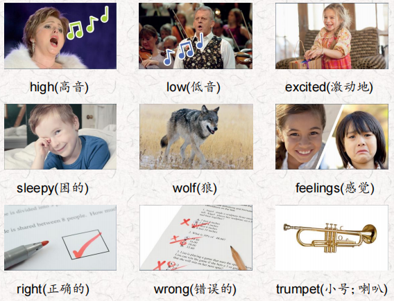
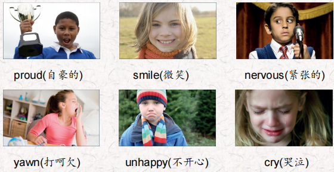
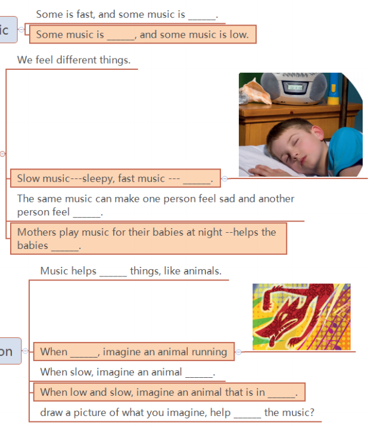
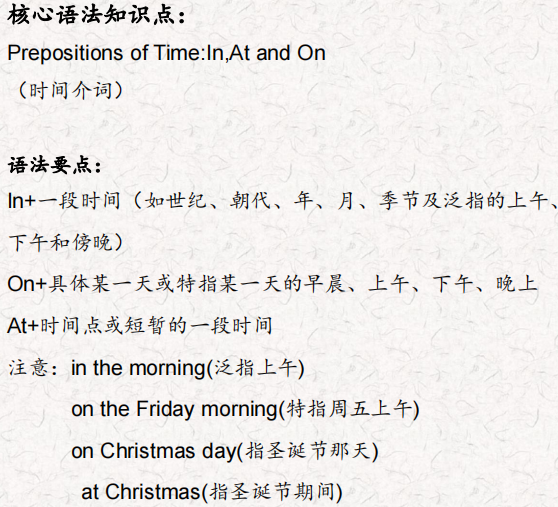
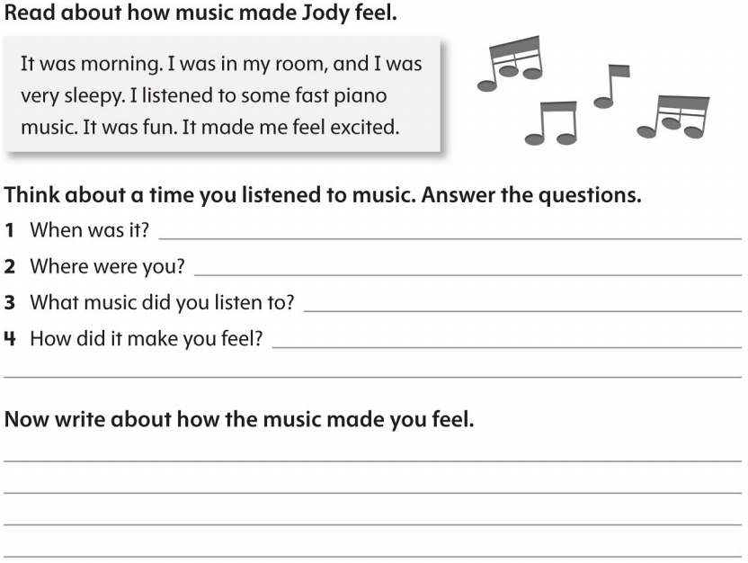

# OD2-Unit13 知识清单

| 上课内容 | Unit13 How Music Makes us Feel | 学习目标 |
| --- | --- | --- |
| 单词1 |  | 会听、会说、会读、会默写 |
| 短语 | so far 到目前 wake up 醒来 be in danger 在危险中 | 短语会造句 |
| 阅读技巧 | To summarize, we tell the most important parts of the text. We don't use a lot of words, and we don't tell a lot of the details. 总结，我们讲述了课文中最重要的部分。我们不会使用很多词汇，也不会讲述很多细节。 |  |
| 重点句型 | Some music is fast, and some music is slow. 有些音乐是快,有些音乐是缓慢的。 Some music is high, and some music is low. 有些音乐是高的，有些音乐是低的。 Listen to this piano music. 听这首钢琴曲。 What can you say about it? 你能说些什么呢? Slow music can make us feel sleepy, and fast music can make us feel excited. 慢音乐可以使我们感到困倦，快音乐可以使我们感到兴奋。 The same music can make one person feel sad and another person feel happy. 同样的音乐可以让一个人感到悲伤，而另一个人感到快乐。 What are the most important parts so far? 到目前为止，最重要的部分是什么? Amanda listens to fast music in the morning so she can wake up. 阿曼达早上听快节奏的音乐，这样她就能醒过来。 we can imagine an animal that is in danger. 我们可以想象一只处于危险中的动物。 What animal does this sound like, a duck or a wolf? 这听起来像什么动物，是鸭子还是狼. |  |
| 听力 | 听力词汇：  听力原文： One. The students are practicing for their school concert. They are noisy. Their teacher, Ms. Potts, is very patient and calm. She asks the students to be quiet. Kevin is practicing the trumpet He's very sleepy and he's yawning. Ms. Potts talks to him, She tells him to have a rest. Kevin feels good now. He's practicing again. lrene is practicing the piano. She has a solo. She plays the piece of music too fast. She is very nervous and cries. Ms. Potts talks to her She tells her she is very good. She tells her to slow down a little. Lrene plays more slowly and the music sounds good. Penny and Charlie are singing their song. They sing too slowly. They feel unhappy and they run away. Ms. Potts finds them and talks to them. She tells them to sing again, and sing faster this time. Penny and Charlie are singing again. The principal, Mr. King, comes in. He listens to the students practice. He's very happy. He's clapping! Ms. Potts is very proud. She knows the students are ready for the concert. She's smiling | 每天听+跟读 |
| 口语 | Giving Opinions Please turn down the music!请把音乐关小一点!为什么?我不喜欢流行音乐。真的，这是我的最爱。 Why? l don't like pop music. Really, it's my favorite. |  |
| 复述课文复述 |  | 根据关键字提示复述课文复述 |
| 语法 |  |  |
| 写作 |  | 仿写 |
