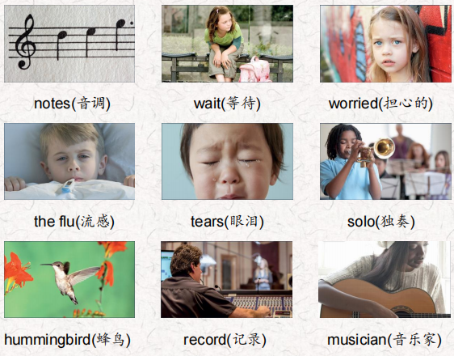
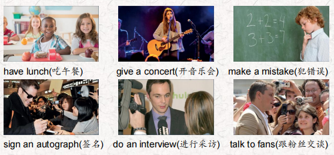
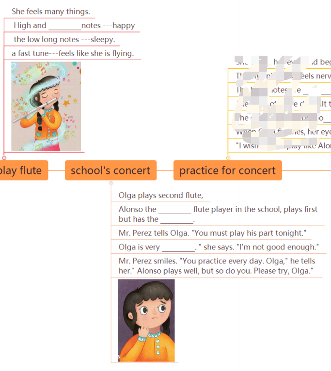
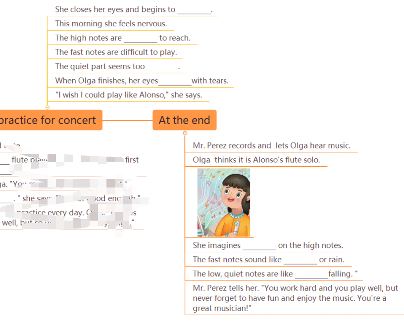
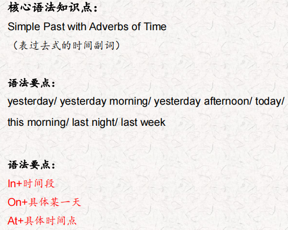
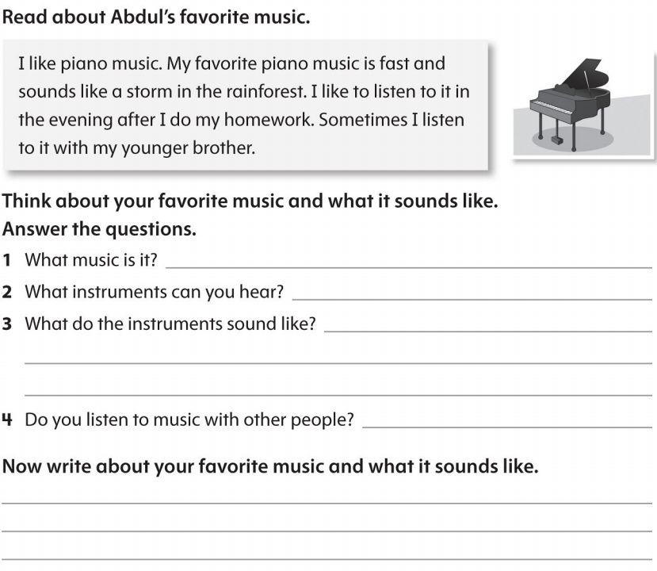

# OD2-Unit14 知识清单

| 上课内容 | Unit14 Olga's Flute | 学习目标 |
| --- | --- | --- |
| 单词 |  | 会听、会说、会读、会默写 |
| 短语 | so do you 你也是 have a concert举办音乐会 waiting for somebody 等某人 feel like 感觉像 | 短语会造句 |
| 阅读技巧 | All stories have characters. Characters are the people animals, or things that are in the story. There are main characters and secondary characters. Main characters are the most important characters.The story is about them. Secondary characters aren't as important as the main characters. 所有的故事都有角色。人物是人、动物或故事中的事物。有主要人物和次要人物。主角是最重要的角色。这个故事就是关于他们的。次要角色不如主要角色重要。 |  |
| 重点句型 | When Olga plays her flute she feels many things. 奥尔加吹笛子的时候，她有很多感觉。 When Olga plays a fast tune, she feels like she is flying.当奥尔加演奏快节奏的曲子时，她感觉自己在飞翔。 Olga's school is having a big concert tonight. 奥尔加的学校今晚有一场大型音乐会。 Today Olga goes to school early for extra practice. 今天奥尔加很早就去学校做额外的练习。 Her music teacher is waiting for her.她的音乐老师正在等她。 Alonso plays well, but so do you. 阿隆索打得很好，但你也一样。 Which character is in this part of the story?哪个角色出现在故事的这一部分? When Olga finishes, her eyes fill with tears。当奥尔加结束时，她的眼里充满了泪水。 I wish I could play like Alonso. 我希望我能像阿隆索那样打球。 She thinks it is Alonso's flute solo. 她以为是阿隆索的长笛独奏。 The fast notes sound like humming birds or rain. 快音符听起来像蜂鸟或雨。 You should listen when you play. 你演奏的时候应该认真听。 I do listen, but I'm often too nervous! 我确实在听，但是我经常太紧张了! You work hard and you play well, but never forget to have fun and enjoy the music. 你努力学习，演奏得很好，但永远不要忘记玩得开心，享受音乐。 |  |
| 听力 | 听力词汇：  听力原文： Hello. My name is Julie Jones and I'm talking to the popular Camer on Barber. Wow! Your fans really like you, Cameron! How are you? Yeah, thanks everyone! I'm great Julie, but I'm very busy. Tell us about it, Cameron. One. Well, my band and I practiced yesterday morning. We practiced some of our songs. I made a mistake. We practiced the wrong songs! Oh, no! How did you feel? Well, I was very unhappy. Two. This afternoon I had lunch. Then I talked to fans outside the hotel. I was really happy. I signed lots of autographs. That's great! Three. I gave a concert in the evening and it was amazing. But l was nervous. We played a lot of new songs. The fans loved the concert! [SFX: Fans calling out " We love you, Camer on! Yes, they did Four. What did you do after the concert was over? Well, I'm giving this interview now and then I want to go home. I'm very tired! Thanks for talking to us, Cameron. You're welcome. Good night, everyone! | 每天听+跟读 |
| 口语 | Describing Music and Emotions描述音乐与情感 I gave a concert. I was proud, Then I signed autographs. I was excited. 我开了一场音乐会。我很骄傲，然后给他签名。我很兴奋。 I played the piano. I was nervous.我弹钢琴。我很紧张。 |  |
| 复述课文 |   | 根据关键字提示复述课文复述 |
| 语法 |  |  |
| 写作 |  | 仿写 |
