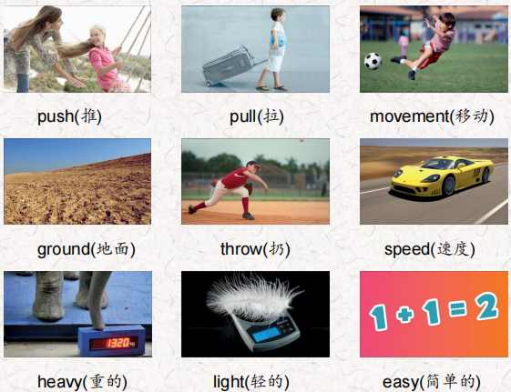
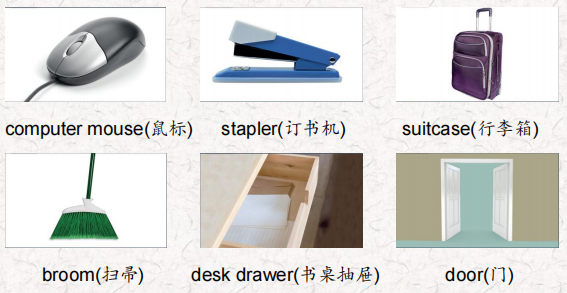
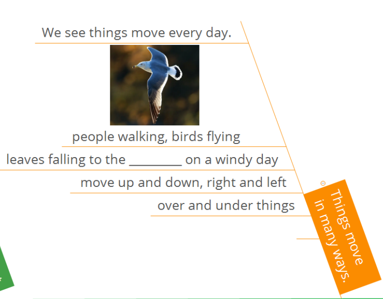
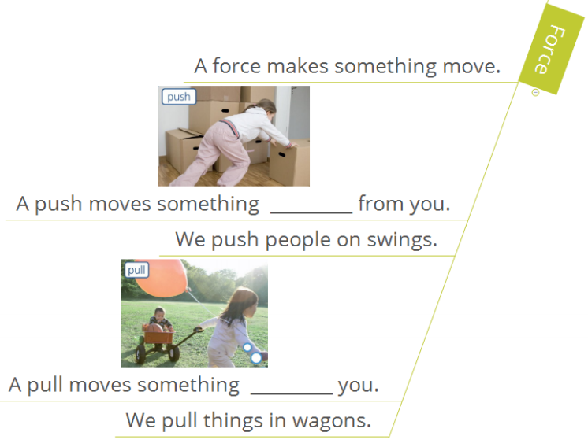
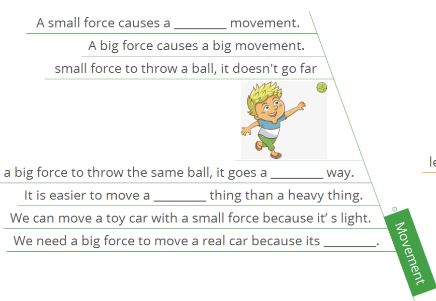
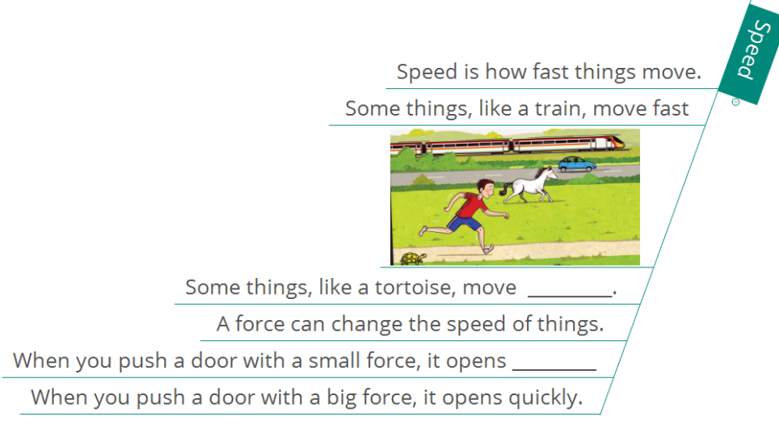
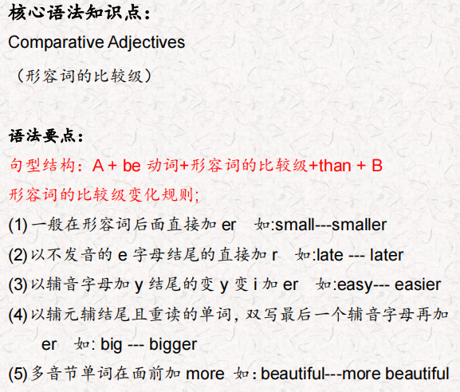
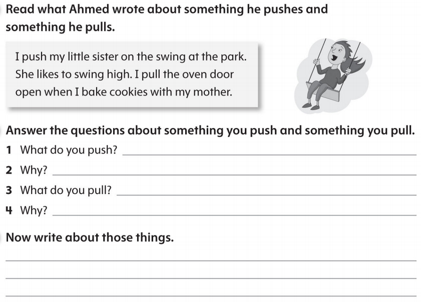

# OD2-Unit15 知识清单

| 上课内容 | Unit15 Forces and Movement | 学习目标 |
| --- | --- | --- |
| 单词1 |  | 会听、会说、会读、会默写 |
| 短语 | in many ways在很多方面 the cause of …的原因 the effect of …的影响 | 短语会造句 |
| 阅读技巧 | Remember, a cause is why something happens. The effect is what happens after the cause. 记住，cause是指某事发生的原因。结果是在原因之后发生的。 |  |
| 重点句型 | We see people walking, birds flying, and leaves falling to the ground on a windy day. 在刮风的日子里，我们看到人们在散步，鸟儿在飞翔，树叶落在地上。 Things move in many ways.事物以多种方式运动。 They move up and down, right and left, and over and under things.它们上下左右移动，在物体上面和下面移动。 A push is a force, and it moves something away from you. 推力是一种力，它使某物远离你。 We push people on swings.我们推着人们荡秋千。 A pull is a force, too, and it moves something toward you. 拉力也是一种力，它使某物向你移动。 Can you name something you push and something you pull? 你能说出你推的和拉的东西吗? It is easier to move a light thing than a heavy thing. 搬动轻的东西比搬动重的东西容易。 We can move a toy car with a small force because it's light. 我们可以用很小的力移动玩具车，因为它很轻。 We need a big force to move a real car because it's heavy.我们需要很大的力来移动一辆真车，因为它很重。 What's the cause of the door opening slowly? 门开得慢的原因是什么? What's the effect of the door being pushed with a small force?用很小的力推门会有什么效果. |  |
| 听力 | 听力词汇：  听力原文： Good morning. Today's class is about forces, Try to guess the things I’m talking about. One. This is something we push and pull. We pull it to open it and we push it to close it, But it's not a door or a window. We put things like pens and erasers in this. What do you think it is? Two. Now this is a thing we push but we never pull. And we always push it down. And we only use one finger to push it! You need this to work on a computer. It's also the name of an animal. Do you know what it is? Three. Sometimes we push this and sometimes we pull it. Sometimes there's a sign to tell us to push or pull. We need to use a force if we want to come in or go out of a place or room. Four. We usually pull this but there are big ones you can push. We use this in our homes and school to keep them clean. Maybe you use this at home or at school when you help your parents or your teacher. Five. We always push this and we always push it down. I think your teacher has one on her desk. We can put a lot of papers together with one little push. What is it? Six We always pull this with one hand. It can be heavy and it's a lot easier to pull it than to carry it, You use it when you take a vacation or visit your grandparents. Don't forget to take your tooth brush! | 每天听+跟读 |
| 口语 | Offering to Help 提供帮助 Phew! L can't move this.唷!我动不了这个。 lt's too heavy. 它太重了。 Let me help you.让我来帮你。 Thanks. That would be great! 谢谢。那太好了! No problem.没有问题。 |  |
| 复述课文复述 |      | 根据关键字提示复述课文复述 |
| 语法 |  |  |
| 写作 |  | 仿写 |
