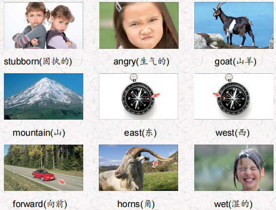
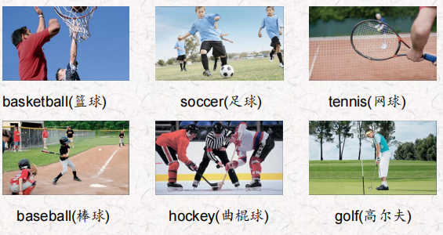
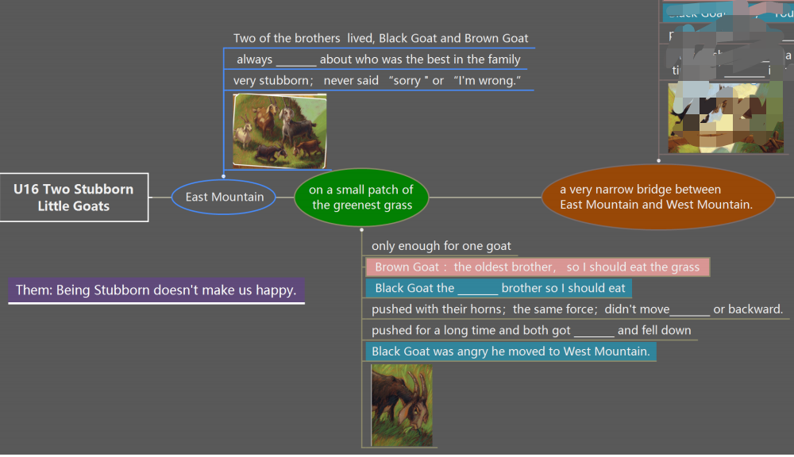
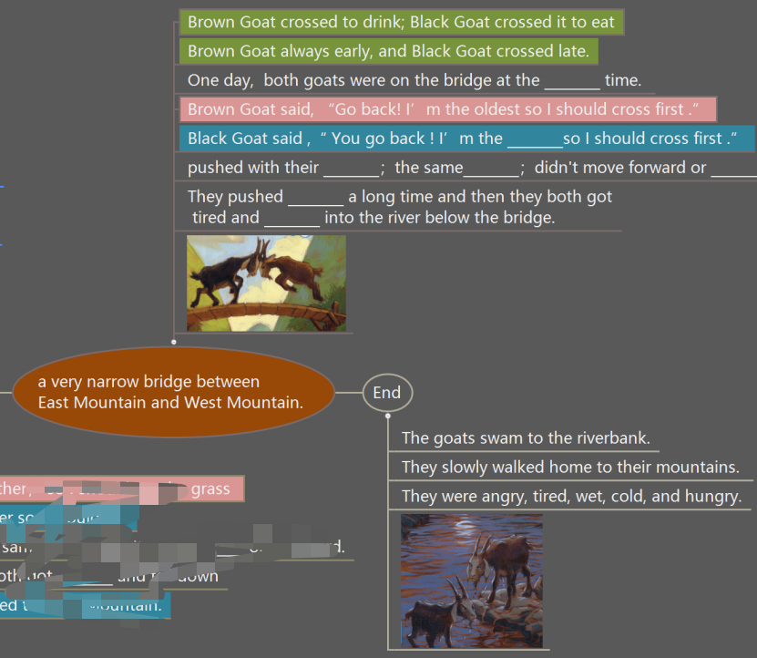
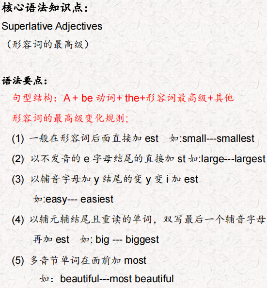
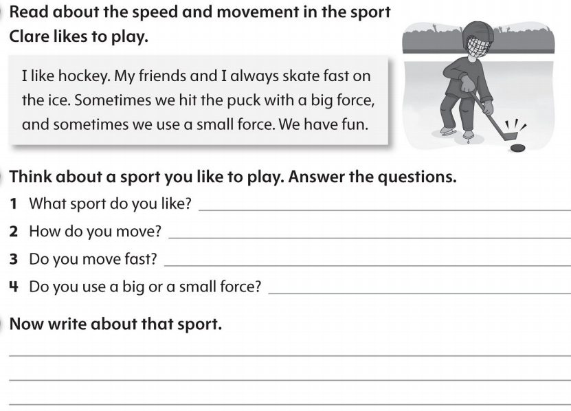

# OD2-Unit16 知识清单

| 上课内容 | Unit16 Two Stubborn Little Goats | 学习目标 |
| --- | --- | --- |
| 单词 |  | 会听、会说、会读、会默写 |
| 短语 | A long time ago 很久以前 a family of goats一家山羊 Two of the brothers兄弟中的两个 a small patch of 一片 | 短语会造句 |
| 阅读技巧 | Remember, the theme of a story is the most important thing the writer wants you to understand. The writer is often teaching something important. 记住，故事的主题是作者想让你理解的最重要的东西。作者通常会教给你一些重要的东西。 |  |
| 重点句型 | A long time ago , a family of goats lived on East Mountain. 很久以前，在东山上住着山羊一家。 Two of the brothers, Blck Goat and Brown Goat, always fought about who was the best in the family. 两兄弟，黑山羊和棕色山羊，总是为谁是家里最好的而争吵。 One day, they were on a small patch of the greenest grass on East Mountain.一天，他们来到了东山最绿的一小块草地上。 I’m the oldest brother in the family, so I should eat the grass.我是家里的大哥，所以我应该吃草。 I’m the smartest brother in the family.我是家里最聪明的弟弟。 They pushed each other with their horns.他们用角互相推搡。 They pushed with the same force, so they didn't move forward or backward.他们用同样的力推，所以他们没有向前或向后移动。 There was a very narrow bridge between East Mountain and West Mountain. 在东山和西山之间有一座很窄的桥。 Every day Brown Goat crossed it to drink from the coldest water in the pond on West Mountain.每天，“棕色的山羊”都要过河去喝河中最冷的水 They pushed for a long time and then they both got tired and fell into the river below the bridge.他们推了很长时间，然后他们都累了，掉进了桥下的河里。 |  |
| 听力 | 听力词汇：  听力原文： One. I'm running fast and I want to kick the ball. Uh- oh! Julian kicked the ball the other way. He kicked it really hard! Now Mandy is kicking the ball to me. Wow! Tom has the ball now and he hit the ball with his head! Two. lt's my turn now. Sometimes it's hard to hit the ball because it's so small. hit the ball very hard and, oh!... it went far. L can't see it now! OK, there it is. It's Elena's turn now. She hit the ball harder than me! lt's going further than my ball. OK Elena, let's walk to the balls to see who can get it in the hole first. Three. OK, there are five people on each team. The ball's in my team's end of the court now and Alice's jumping up and throwing the ball in the hoop. Yes! That's two points for my team. Four. Now their team is up to bat. Ali's throwing the ball very hard. He wants it to go very fast so the man can't hit it. He tries but he doesn't hit it. Strike 1! Yes! OK, Ali's throwing the ball again. This time he's throwing the ball too slow and, oh.no!.... He hits it. They're running and....That's one run for their team. Five. Dan's skating towards the hockey puck and he hits it very hard and it goes very far. Now the other team has it and they hit it hard, too. But my team gets it back. Yusuf's skating very fast but he's pushing the puck very slowly. He's getting close to the goal. He hits it hard! Yes! He hits the puck into the goal! We win! Six. Donna's running backwards and she hits the ball really hard Now Sarah is running backwards and she hits the ball back to Donna. But she doesn't hit it hard so Donna has to run forward. She misses the ball. That's a point for Sarah. | 每天听+跟读 |
| 口语 | Describing Sports描述运动 I run, jump, and throw the ball.我跑，跳，扔球。 You're playing basketball.你在打篮球。 |  |
| 复述课文 |   | 根据关键字提示复述课文复述 |
| 语法 |  |  |
| 写作 |  | 仿写 |
