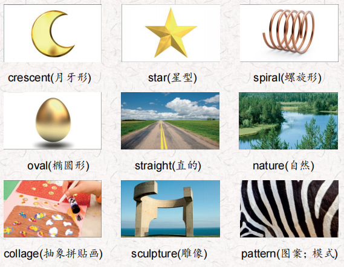
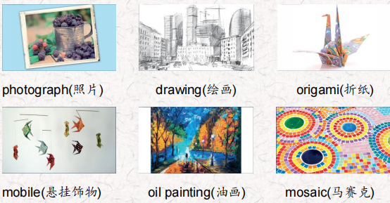
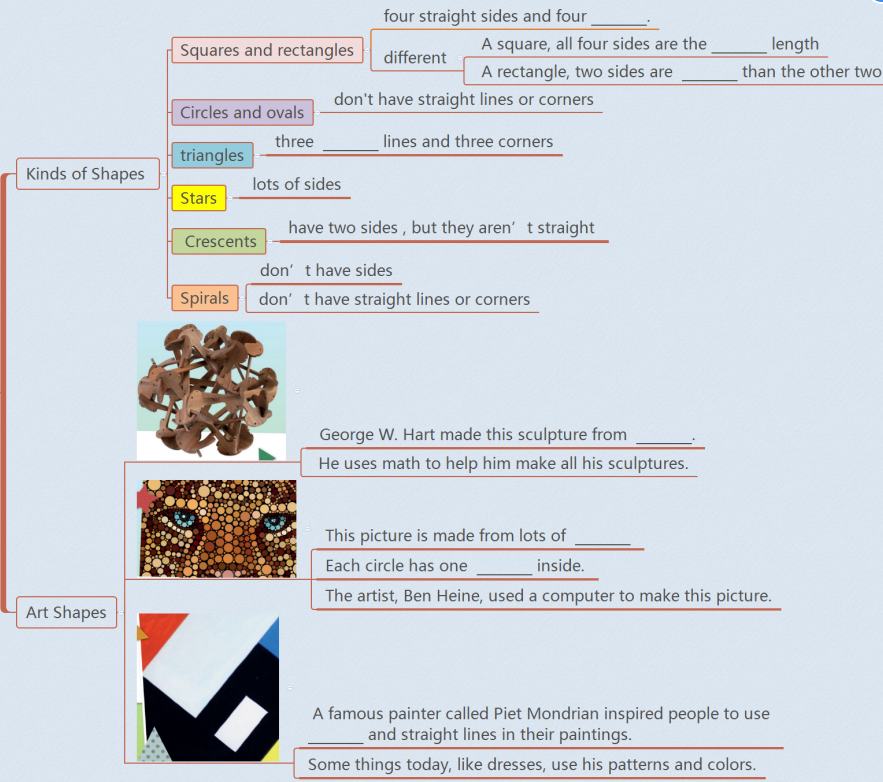
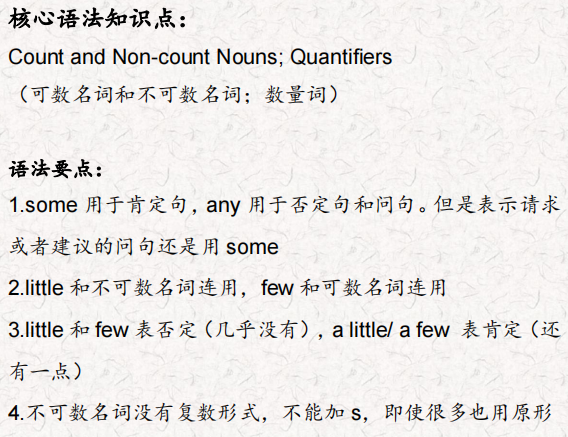
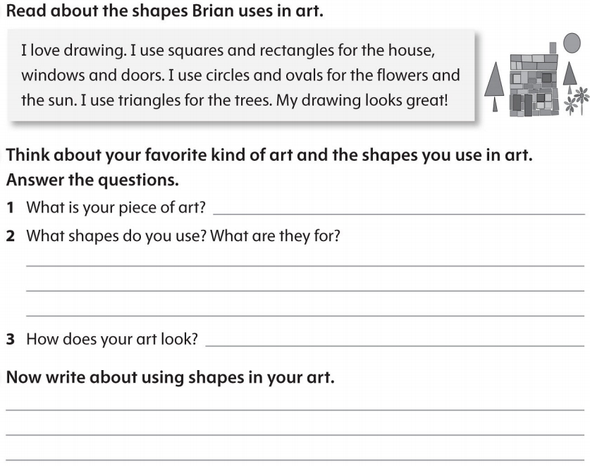

# OD2-Unit17 知识清单

| 上课内容 | Unit17 Shapes in Art | 学习目标 |
| --- | --- | --- |
| 单词1 |  | 会听、会说、会读、会默写 |
| 短语 | look for 寻找 a piece of一片 made from 由…做出 different kinds of 不同种类的… | 短语会造句 |
| 阅读技巧 | When we read something, we can think about things in our lives that are similar to things in the text.当我们读到一些东西时，我们可以想到我们生活中的事情和文章中的事情相似。 |  |
| 重点句型 | We can see shapes in people, animals, nature, art and much more in our world.我们可以看到形状的人，动物，自然，艺术和更多的在我们的世界. Squares and rectangles have four straight sides and four corners.正方形和矩形有四个直边和四个角。 How are squares and rectangles different?正方形和长方形有什么不同? A square has four corners and all four sides are the same length.正方形有四个角，四条边的长度都是一样的。 A rectangle also has four corners but two sides are longer than the other two.矩形也有四个角，但其中两个边比另外两个长。 Circles and ovals don't have straight lines or corners. 圆形和椭圆形没有直线或角。 All triangles have three straight lines and three corners.所有三角形都有三条直线和三个角。 Stars, crescents, and spirals are all very different kinds of shapes.星形、新月形和螺旋形都是非常不同的形状。 What shapes do you see in this nature collage? 你在这幅自然拼贴画中看到了什么形状. He uses math to help him make all his sculptures.他用数学来帮助他制作所有的雕塑。 This picture is made from lots of circles and each circle has one color inside it.这幅画是由许多圆圈组成的，每个圆圈里面都有一种颜色。 A famous painter called Piet Mondrian inspired people to use shapes and straight lines in their paintings. 展示一个著名画家蒙德里安启发人们使用形状和在他们的画直线。 The next time you paint, draw, or make a piece of art, look for the shapes in your world to help you.下次你画画或做艺术品的时候，在你的世界里寻找形状来帮助你。 |  |
| 听力 | 听力词汇：  听力原文： One. I'm at the park now. There are beautiful red and pink flowers near the fountain. They look like stars, I'm taking out my camera now. I can see some honeybees by the flowers. Look! These are good! Two. 'm using colorful pieces of square paper. I'm folding them into different shapes. I really like to make animals I made a beautiful bird yesterday so today l want to make a tree. Three. I'm using a lot of small pieces of glass. I'm using oval green pieces for the grass and yellow and orange pieces for the flowers. I put them on the board with glue. Wow! it looks great! Four. I'm using this special paint and a paintbrush to paint this picture of a mountain. I'm mixing yellow and blue paint to make green. I need more blue to make dark green. I'm painting the leaves on a big tree now. I need to be careful because the brown paint is still wet. Five. I painted two small pieces of wood, one red and one blue. Then I made an origami ship, airplane, train, motorcycle, and speedboat. Now I'm tying the ship and airplane to the red piece of wood, and the train, motorcycle and speedboat to the blue piece of wood. Good! I want to hang this over my desk in my room! Six I'm sitting on a bench in the rainforest and l have my special pencils and paper with me. I'm starting my picture of this | 每天听+跟读 |
| 口语 | Complimenting 称赞 Wow! That's a really great mobile!哇!这是一款非常棒的手机! Thank you. 谢谢你！ You're very good at art.你很擅长艺术 Thanks. And you're good at math! 谢谢。而且你数学很好 |  |
| 复述课文复述 |  | 根据关键字提示复述课文复述 |
| 语法 |  |  |
| 写作 |  | 仿写 |
