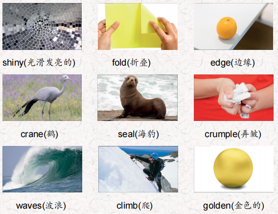
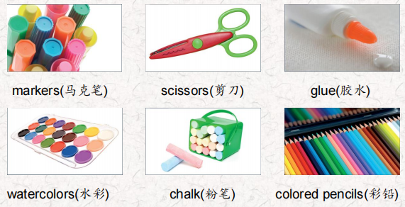
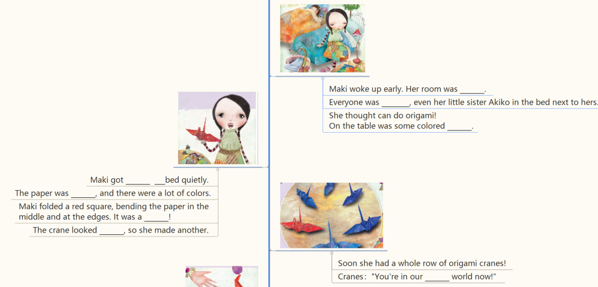
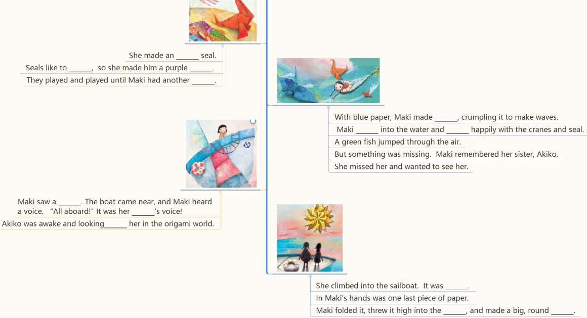
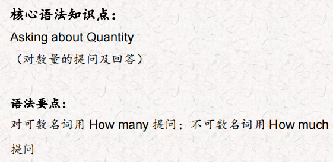
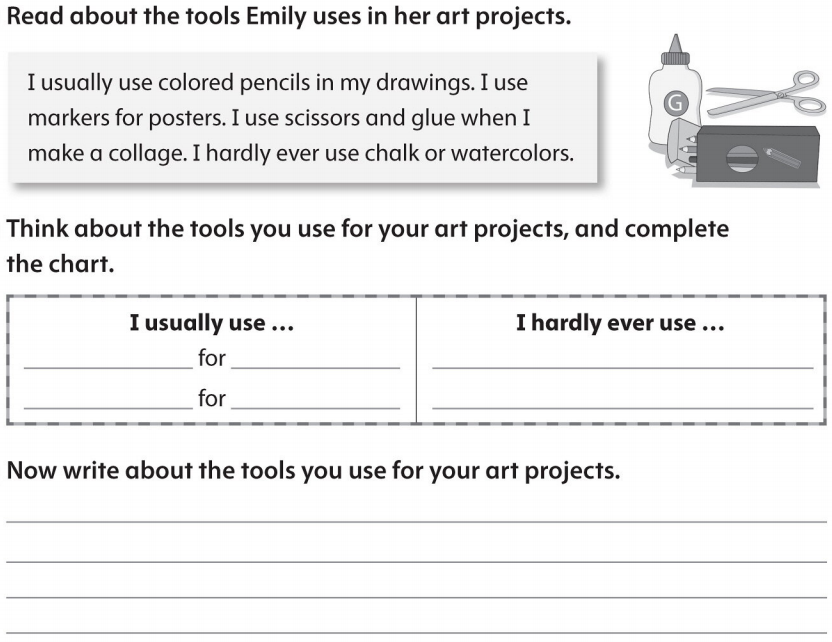

# OD2-Unit18 知识清单

| 上课内容 | Unit18 Origami | 学习目标 |
| --- | --- | --- |
| 单词 |  | 会听、会说、会读、会默写 |
| 短语 | next to 在…旁边 pick up捡起 get out of 离开，从……出来 | 短语会造句 |
| 阅读技巧 | Remember when we read something, we should think about things in our lives that are similar to things in the text. 记住，当我们阅读一些东西的时候，我们应该想想我们生活中与文章中相似的事情。 |  |
| 重点句型 | Everyone was sleeping, even her little sister Akiko in the bed next to hers.每个人都在睡觉，甚至她的小妹妹明子也睡在她旁边的床上。 What could she do? 她能怎么办呢? On the table was some colored paper.桌子上放着一些彩纸。 Maki got out of bed quietly.  Maki悄悄地下了床. Maki folded a red square, bending the paper in the middle and at the edges. Maki 折了一个红色的正方形，把纸的中间和边缘都折弯。 She worked until it was done.她一直干到干完为止 The crane looked lonely, so she made another.鹤看起来很孤独，所以她又做了一个。 Soon she had a whole row of origami cranes!很快，她就有了一整排纸鹤! Would you like some friends?你想要一些朋友吗? So Maki picked up more paper.于是Maki拿起更多的纸. And he rolled the ball back to her. 他把球滚回给她。 They played and played until Maki had another idea.他们弹啊弹，直到Maki有了另一个主意。 Maki dived into the water and swam happily with the cranes and seal. Maki跳进水里，和鹤和海豹一起愉快地游了起来。 Akiko was awake and looking for her in the origami world.明子醒了，在折纸世界里找她。 She climbed into the sailboat. 她爬上了帆船。 In Maki's hands was one last piece of paper.Maki手里拿着最后一张纸。 |  |
| 听力 | 听力词汇：  听力原文： one. OK, Aisha. Do you remember what you need to get? Yes, Mom. I need some glue. How much glue do you need? I need a lot of glue. Look at this big bottle! l want this one. OK. What else do you need? Markers? No, I don't need markers. I have some markers. I need newsCissor5. OK Is that everything? Yes, Mom. Now I need to find lots of pictures! Let's go home so I can start my project. Two. OK, class. Please listen. Did everyone draw on their plastic containers with chalk? Yes, Ms. Peters. Great. Please bring them over here. They look good. Now let's start putting the containers on top of each other with glue. lt's getting very tall. Yes, Mina. This will show everyone how many plastic containers our class uses in one day. Let's put this outside our classroom. Good job, everyone. Three. Hi, Grant. What's that? lt's the ground of the forest. I painted it with water colors and then colored the mountains and the pond with colored pencils. It looks good, Grant. Thanks, Dad. Now I'm making animals to go in the forest. I'm using these papers to make them. Look at this one. Do you know what it is? Of course! It's a wolf! That's amazing. Yes, and I also made an eagle, an opossum and a mouse. Look! Wow! Did you use scissors? No, I didn't. I don't need scissors! | 每天听+跟读 |
| 口语 | Describing Art描述艺术 It's a picture of the rainforest. 是一幅热带雨林的画。 I used green and brown pieces of stone for the trees.我用绿色和棕色的石头做树。 You made a mosaic.你做了一个马赛克。 |  |
| 复述课文 |   | 根据关键字提示复述课文复述 |
| 语法 |  |  |
| 写作 |  | 仿写 |
