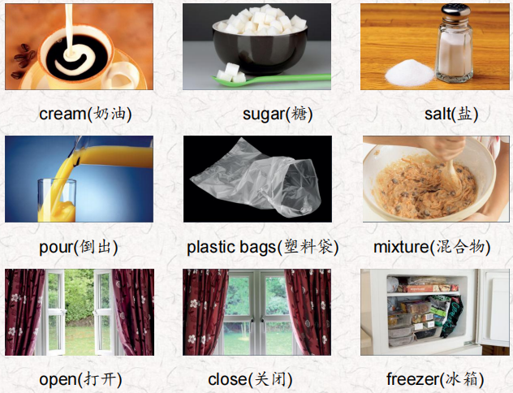
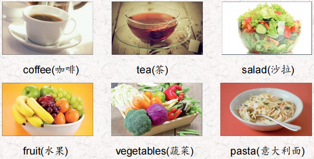
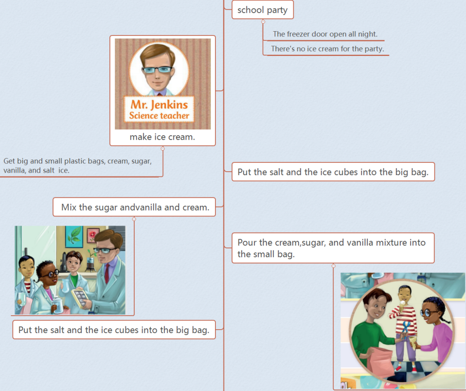
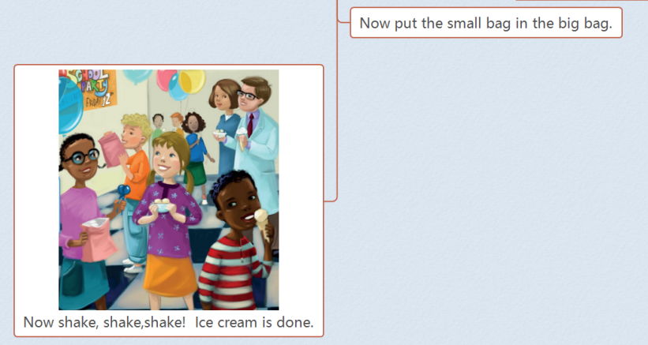
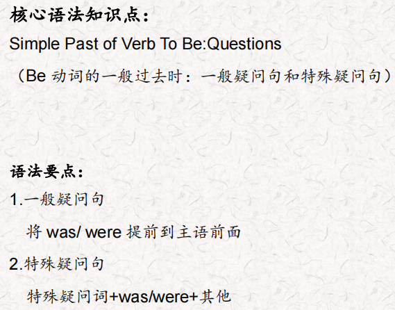
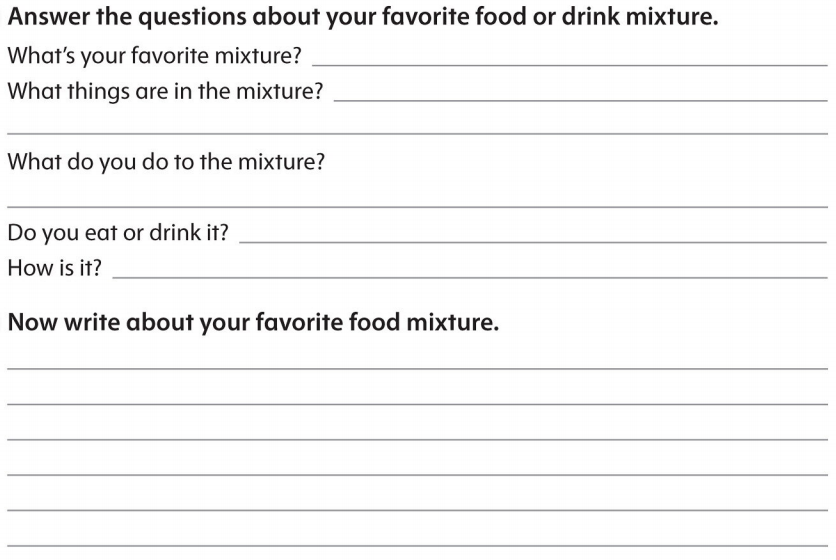

# OD2-Unit4 知识清单

| 上课内容 | Unit4 Let's Make Ice Cream! | 学习目标 |
| --- | --- | --- |
| 单词 |  | 会听、会说、会读、会默写 |
| 短语 | all night一整晚 What's wrong? 怎么了？ It's great! 真棒极了！ | 短语会造句 |
| 阅读技巧 | Remember, a cause is why something happens. The effect is what happens after the cause. 记住，cause是指某事发生的原因。结果是在原因之后发生的。 |  |
| 重点句型 | Let's go to the cafeteria and get the ice cream you bought yesterday. 我们去自助餐厅拿你昨天买的冰淇淋吧。 Was the freezer door open?冰箱门开着的吗? It was open all night. 它整晚都开着的。 Now there's no ice cream for the party.现在派对上没有冰淇淋了。 What's wrong?怎么了? It was our job to bring the ice cream for the party, but it melted. 我们的工作是为聚会带来冰淇淋，但是它化了。 My freezer was closed all night, so I have ice.我的冰箱整晚都关着，所以我有冰块。 Pour the cream, sugar, and vanilla mixture into the small bag.将奶油、糖和香草混合物倒入小包中。 Put the salt and the ice cubes into the big bag.把盐和冰块放进大袋子里。 Can I have some more? 我能再来点吗 |  |
| 听力 | 听力词汇：  听力原文： Hello, everyone! Today we're making some great foods and drinks. Is everybody hungry? One. Some people drink coffee in the morning, but some people like this drink more. We boil the kettle and get the cup ready. We put leaves in the cup and add the hot water. Be careful, this can be very hot! Two. We wash the cucumbers and the tomatoes, and then we cut them. Put them together, add some avocado and mix them. We can put in other vegetables or even fruit. Yum! This food is very good on a hot day. Three. We heat tomatoes and onions and other vegetables, and then we add the sausages and cook this mixture for a short time Then we put another food into very hot water and cook it OK, it's ready, and we put it on a plate. Then we put the tomato sauce, sausages, and onion mixture on top of it. That smells good! | 每天听+跟读 |
| 口语 | Describing food and ingredients描述食物和配料 This is very good. 这很好。 lt was chicken, cheese, and bread. 是鸡肉、奶酪和面包。 What is it now?现在是什么情况? Tell me about the party.告诉我关于聚会的事。 My friends were there. The ice cream was tasty. The games were fun.我的朋友们也在那里。冰淇淋很好吃。游戏很有趣。 |  |
| 复述课文 |   | 根据关键字提示复述课文复述 |
| 语法 |  |  |
| 写作 |  | 仿写 |
