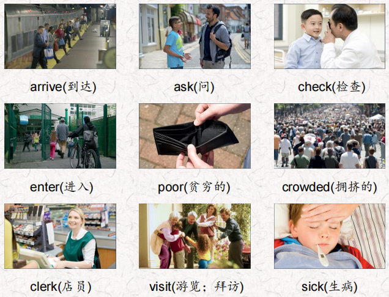
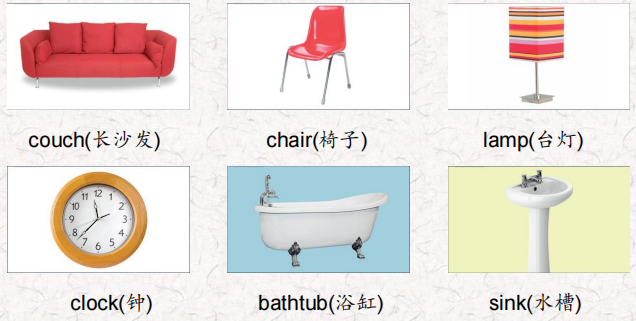
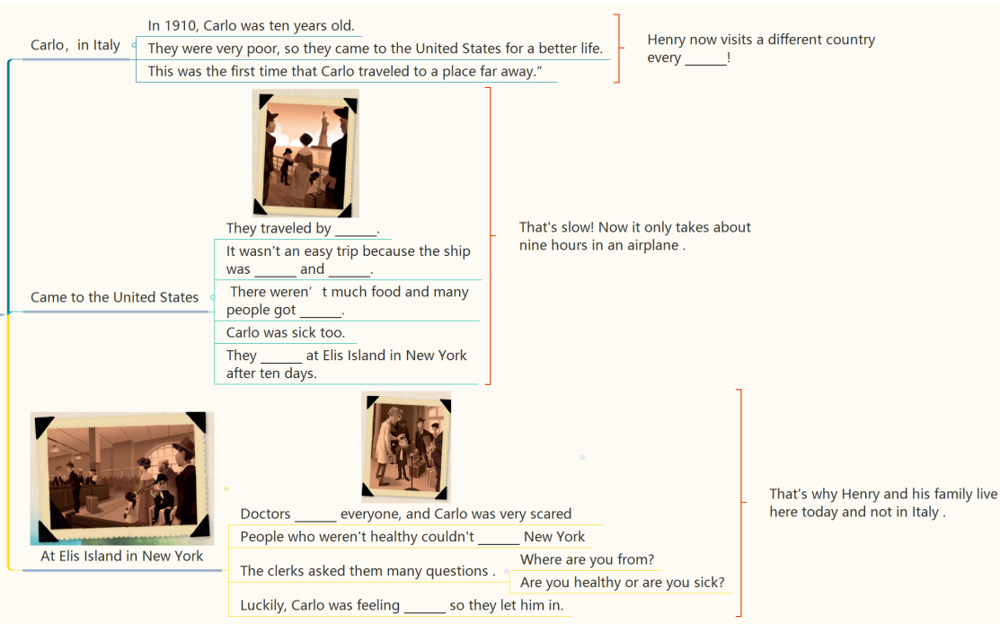
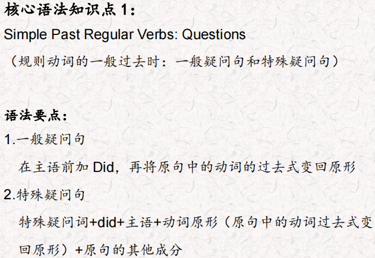
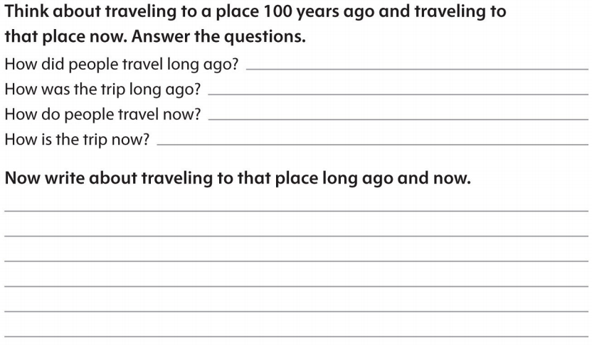

# OD2-Unit6 知识清单

| 上课内容 | Unit6 Tell Me a Story, Grandpa | 学习目标 |
| --- | --- | --- |
| 单词 |  | 会听、会说、会读、会默写 |
| 短语 | a story about 关于什么的故事 the first time 第一次 get sick 生病 What happened？发生了什么？ take a trip to 去…旅行 | 短语会造句 |
| 阅读技巧 | Sequence is the order of things, such as 1, 2, 3, 4 or a, b, c, d. Stories often have a sequence. Events in a story happen in an order. 顺序是事物的顺序，比如1、2、3、4或a、b、c、d。故事通常有一个顺序。故事中的事件是按顺序发生的 |  |
| 重点句型 | I'll tell you a story about my grandfather, Carlo. 我要给你们讲一个关于我祖父卡罗的故事。 In 1910, Carlo was ten years old.1910年，卡洛十岁。 they came to the United States for a better life. 他们来到美国是为了过上更好的生活。 This was the first time that Carlo traveled to a place far away. 这是卡罗第一次到很远的地方旅行。 Mom, Dad, and I visit a different country every summer! 妈妈、爸爸和我每年夏天都会去一个不同的国家! It wasn't an easy trip because the ship was crowded and dirty. 这不是一次轻松的旅行，因为船上又挤又脏。 There wasn't much food and many people got sick.没有多少食物，很多人生病了。 They arrived at Ellis Island in New York after ten days.十天后，他们到达了纽约的埃利斯岛 Now it only takes about nine hours in an airplane.现在坐飞机只需要9个小时。 What happened at Ellis Island?在埃利斯岛发生了什么? Are you healthy or are you sick?你是健康还是生病? Carlo was feeling better so they let him in. 卡洛感觉好多了，所以他们让他进来了 And that's why we live here today and not in Italy.这就是我们今天生活在这里而不是意大利的原因。 Let's take a trip to Italy. 我们去意大利旅行吧。 |  |
| 听力 | 听力词汇：  听力原文： One. Students, this is a great museum. We can see things that people used a long time ago here. Look at this. How do you turn it on? You don't turn it on, There's a candle inside it. A candle! How did they read at night a long time ago? Most people didn't read at night, Emily! Two. Did people sit in that and wash, Ms. King? lt's very small Yes, they did, a very, very long time ago. That one is very very old. Where did the water come from? They poured water in it from a big container, But first they heated the water! Good! Three. Look at that! It's really small. And it's so plain! Did students sit on them all day? Yes, they did. Children were smaller a long time ago. Really? I didn't know that. Four. Look at those numbers. They're very fancy. Yes. They used those numbers a long, long time ago. Hey, I know what time it is. I can't read the numbers, but they're in the same place as the ones we have now. Five. Everything in here is small but look at that! lt's big. Yes, it is. People used it to wash their hands and face. But there was no hot water then. I don't want to wash with cold water! I'm glad we have hot water now! Six. Look at that! It's small. Today they're big! Yes. I fall asleep on ours sometimes! Long ago two people could sit on that! And it wasn't long enough to sleep on. I'm really happy I can sleep on mine! | 每天听+跟读 |
| 口语 | Describing travel and transport 描述旅行和交通 Where did you travel? 你去哪里旅行了? I traveled to Washington.我去了华盛顿。 How did you travel there?你是怎么去那里旅行的? |  |
| 复述课文 |  | 根据关键字提示复述课文复述 |
| 语法 |  |  |
| 写作 |  | 仿写 |
