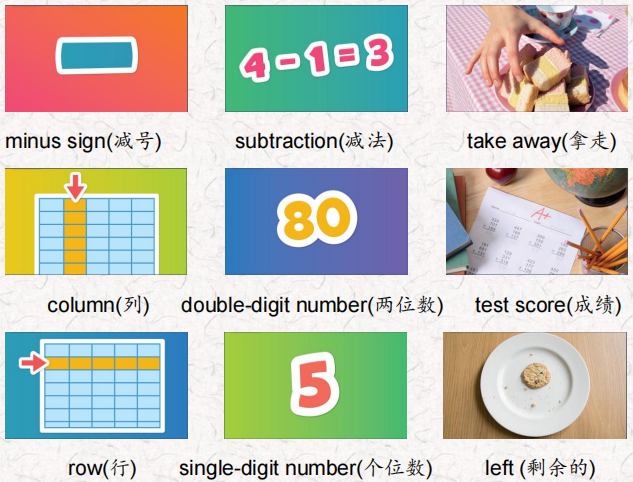
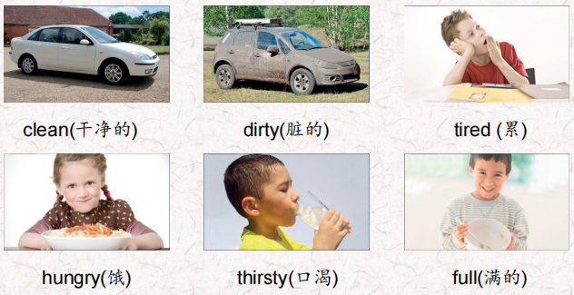
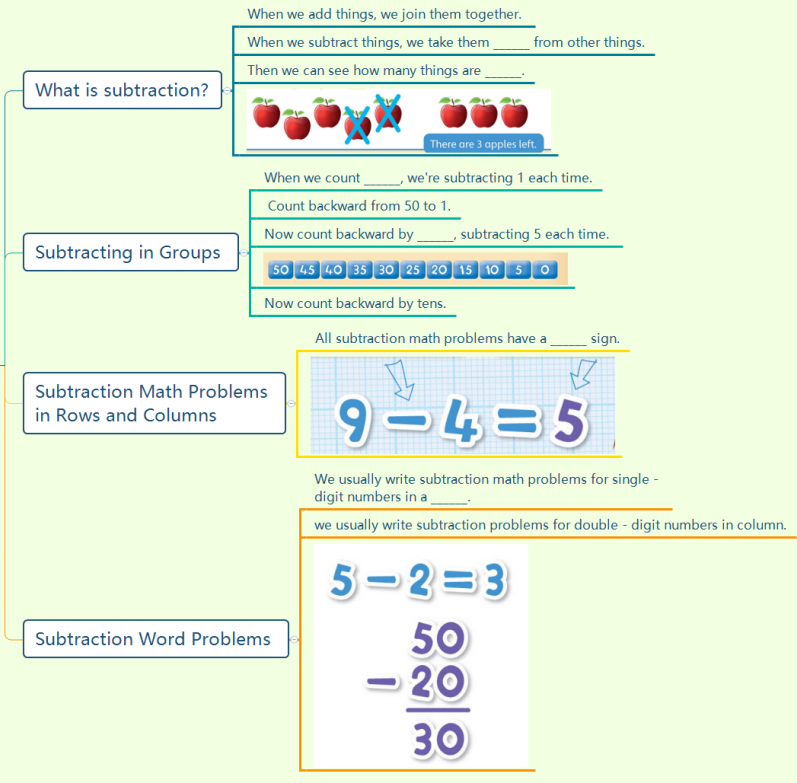
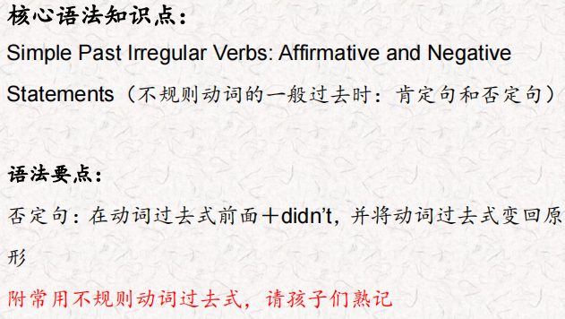
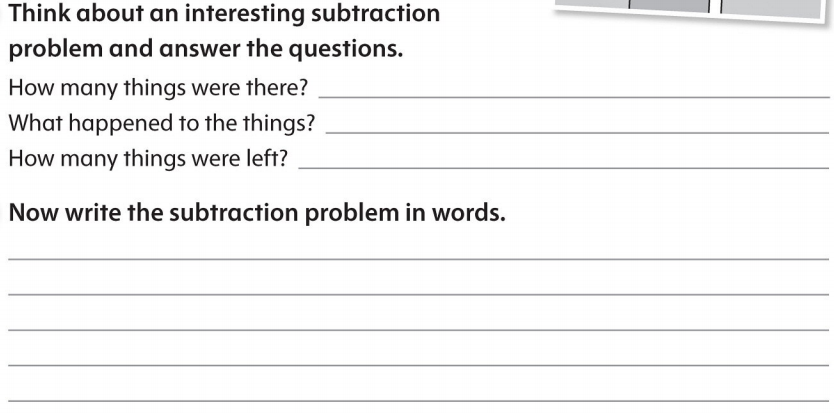

# OD2-Unit7 知识清单

| 上课内容 | Unit7 Subtraction | 学习目标 |
| --- | --- | --- |
| 单词1 |  | 会听、会说、会读、会默写 |
| 短语 | join together合并或连接在一起 take away减去 count backward by fives以5为单位倒数 each time 每次 test score 考试成绩 | 短语会造句 |
| 阅读技巧 | To reread means to read a text again. You can reread something for many different reasons, such as when you don't understand something. When you reread, read slowly and think about what you're reading. 重读是指再读一篇文章。你可以因为很多不同的原因重读一些东西，比如当你不理解一些东西的时候。当你重读的时候，慢慢读，思考你正在读的内容。 |  |
| 重点句型 | When we add things, we join them together. 当我们添加东西时，我们把它们连接在一起。 When we subtract things, we take them away from other things. 当我们做减法的时候，我们把一个数从另一个数中减去。 Then we can see how many things are left.然后我们可以看到还剩下多少东西。 When we count backward, we're subtracting 1 each time. 当我们向后数的时候，每次都减去1。 Count backward from 50 to 1. 从50倒数到1。 Now count backward by fives subtracting 5 each time. 现在向后数，每次5减去5。 Now count backward by tens.现在按十倒数。 How much are you subtracting each time now?现在每次要减去多少? The minus sign tells us to subtract 4 from 9.负号告诉我们9减去4。 Nine minus four equals five. 九减四等于五。 Now think of some things that people subtract every day.现在想想人们每天都要减法的东西。 My teacher subtracts numbers from 100 for my test score! 我的老师用100减去数字来计算我的考试成绩。 |  |
| 听力 | 听力词汇：  One. There were sixty hungry people. Thirty ate pasta and salad How many hungry people are there now? Two. There were ninety dirty buses. A man washed seventeen. How many dirty buses are there now? Three. There were fourteen tired girls. Thirteen took a nap. How many tired girls are there now? Four. There were eighteen thirsty kittens. Fifteen drank some milk. How many thirsty kittens are there now? Five. There were sixty clean pots in the restaurant, The cook used fifty pots. How many clean pots are there now? Six. There were seventeen hungry boys. They ate some sandwiches. Eleven boys were still hungry. How many boys were full? | 每天听+跟读 |
| 口语 | Offering 建议 Would you like some fruit? 你想要一些水果吗? No, thank you. I'm full.不，谢谢。我吃饱了。 How about some water? 喝点水怎么样? Yes, please. I'm thirsty.是的,请。我渴了。 |  |
| 复述课文复述 |  | 根据关键字提示复述课文复述 |
| 语法 |  |  |
| 写作 |  | 仿写 |
