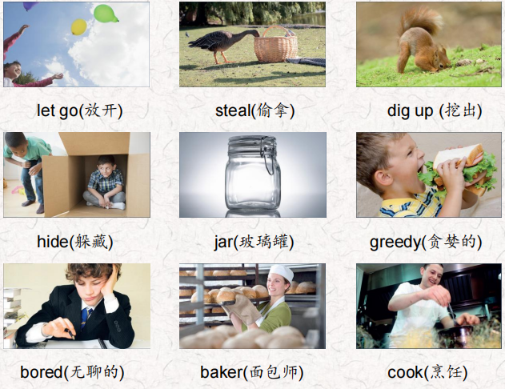
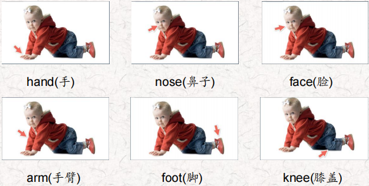
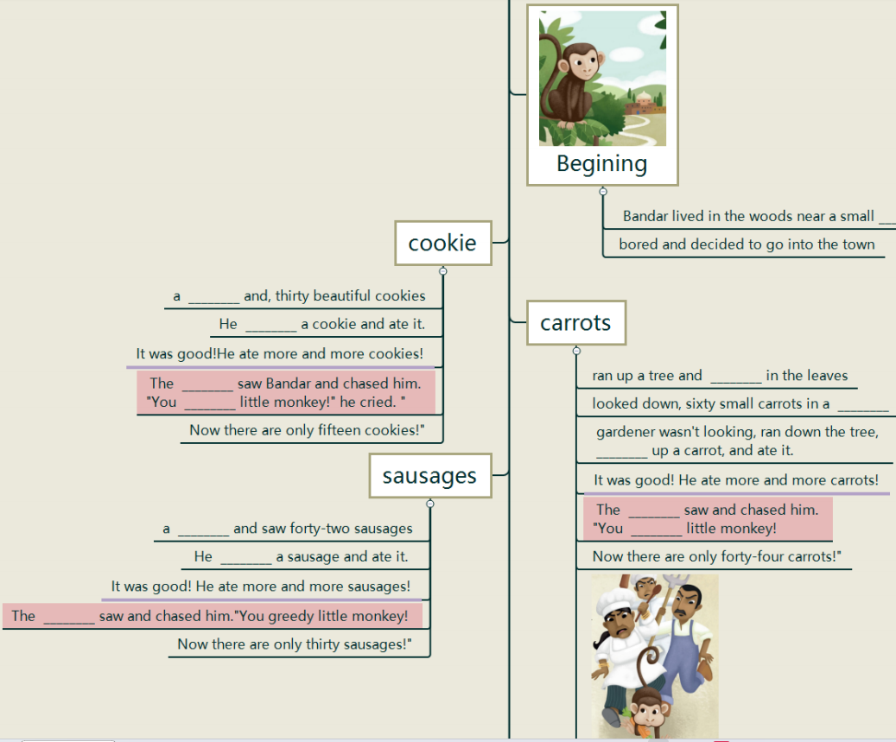
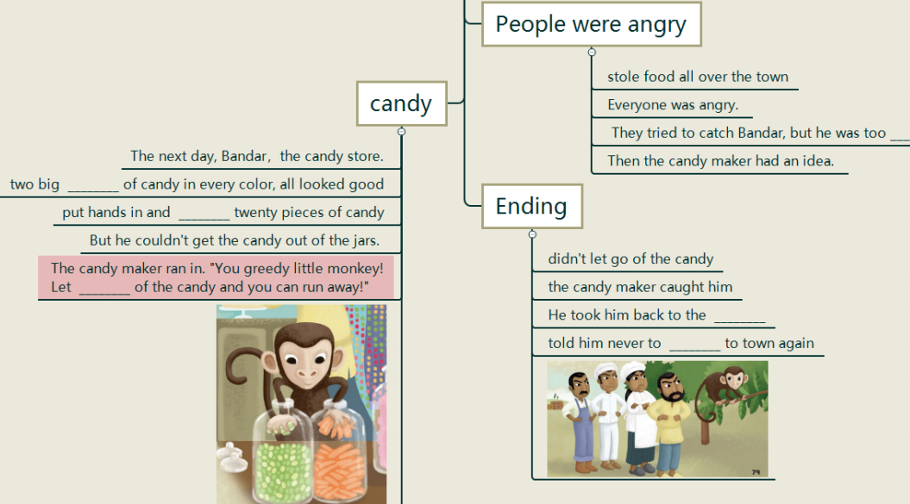
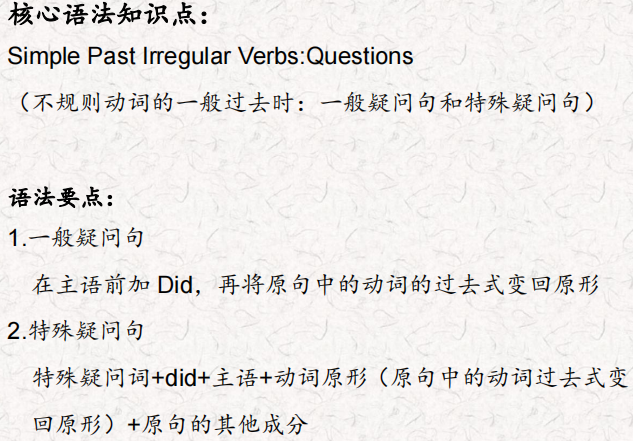
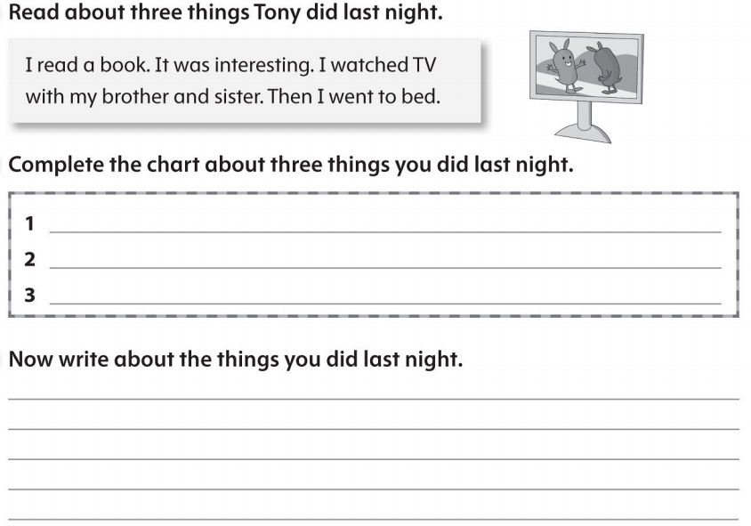

# OD2-Unit8 知识清单

| 上课内容 | Unit8 Bandar, the Greedy Monkey | 学习目标 |
| --- | --- | --- |
| 单词 |  | 会听、会说、会读、会默写 |
| 短语 | decided to do 决定做 ran up 跑上 ran down 跑下 all over the town 全城 have an idea 有想法，头脑中产生了一个新的想法 Let go 松开 | 短语会造句 |
| 阅读技巧 | Stories have three parts. a beginning: Mary baked ten cookies for her friends. a middle: Her brothers were hungry and ate eight cookies. an end: Mary only had two cookies left for her friends. 故事有3部分，开头 中间，结局。 |  |
| 重点句型 | Bandar was bored and decided to go into the town.班达尔觉得无聊，决定进城去。 He ate more and more cookies!他吃了越来越多的饼干! The baker saw Bandar and chased him.面包师看到了班达尔，就追赶他。 Bandar ran up a tree and hid in the leaves.班达尔跑到一棵树上，躲在树叶里。 Bandar ran down the tree, dug up a carrot, and ate it. 班达尔跑下树，挖出一根胡萝卜，吃了它。 You greedy little monkey! 你这个贪婪的小猴子! Bandar stole food all over the town.班达尔在镇上到处偷食物。 They tried to catch Bandar, but he was too fast. 他们试图抓住班达尔，但他太快了。 Then the candy maker had an idea.这时糖果制造商有了一个主意。 The next day, Bandar went to the candy store. 第二天，班达尔去了糖果店。 He saw two big jars of candy in every color, and it all looked good! 他看到两大罐各种颜色的糖果，看起来都很好 But he couldn't get the candy out of the jars. !但是他无法把糖果从罐子里拿出来。 Let go of the candy and you can run away!" 放开糖果，你就可以跑了! He took him back to the woods and told him never to come to town again. ”他把他带回到树林里，告诉他永远不要再来镇上。 |  |
| 听力 | 听力词汇：  听力原文： One. Fifty monkeys jumped in the street. Twenty monkeys hurt their feet. How many monkeys with good feet were left in the street? Two. Thirty-five monkeys smelled some roses. Honeybees bit ten monkeys' noses. How many monkeys with good noses were left near the roses? Three. Forty-five monkeys sat in trees. Fifteen fell down and hurt their knees. How many monkeys with good knees were left in the trees? Four. Seventy monkeys ran around on farms. Twenty monkeys hurt their arms. How many monkeys with good arms were left on the farms? Five. Thirty monkeys walked around town. Ten hurt their hands when they fell down. How many monkeys with good hands were left in town? Six. Sixty monkeys played in fun places. Fifty-five monkeys got very dirty faces. How many monkeys with clean faces were left in fun places? | 每天听+跟读 |
| 口语 | Say a math problem说一道数学题 Twenty cows sat in some trees.二十头牛坐在几棵树上。 Five fell down and hurt their knees.五个人摔倒了，膝盖受伤了。 How many cows were left in the trees?树上还剩下多少头牛? |  |
| 复述课文 |   | 根据关键字提示复述课文复述 |
| 语法 |  |  |
| 写作 |  | 仿写 |
