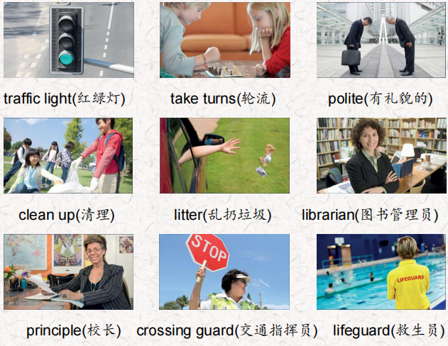
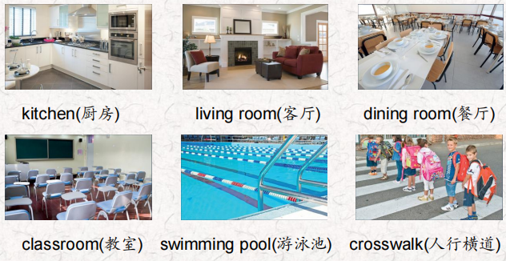
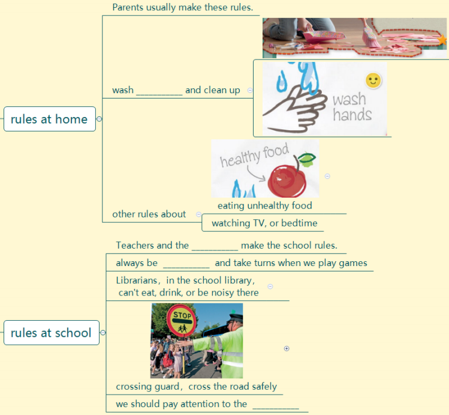
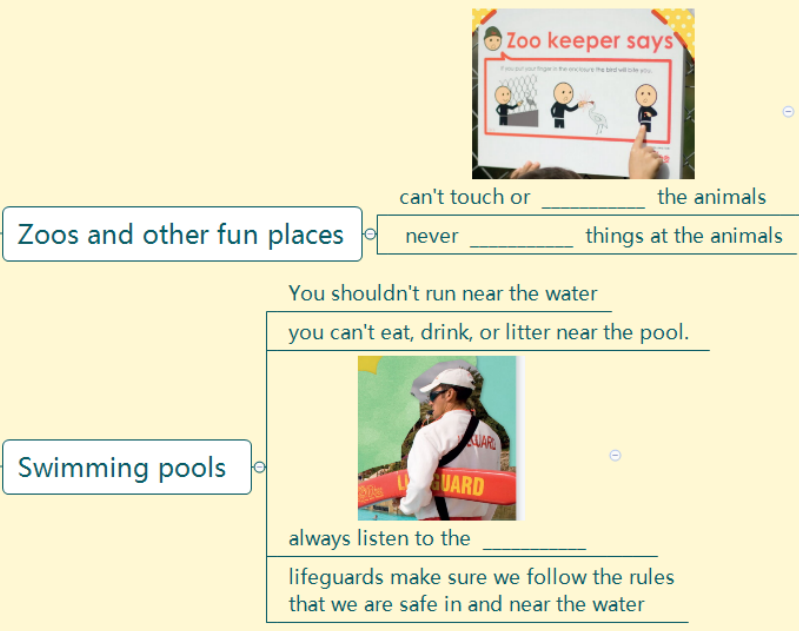
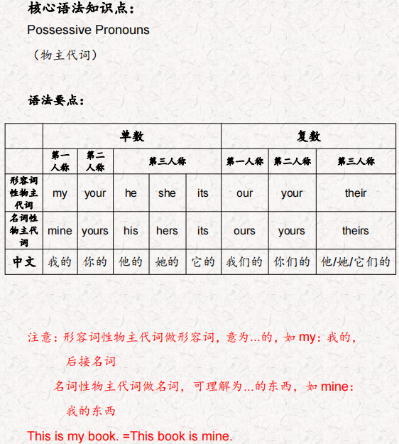
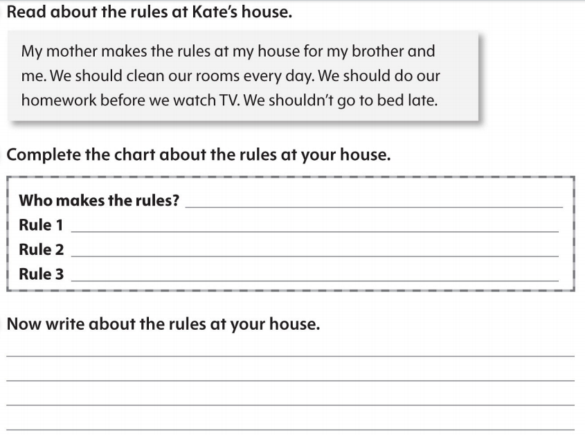

# OD2-Unit9 知识清单

| 上课内容 | Unit9 Following Rules | 学习目标 |
| --- | --- | --- |
| 单词1 |  | 会听、会说、会读、会默写 |
| 短语 | make sure 确保 make rules 制定规则 watch TV 看电视 take turns 轮流 pay attention to 注意 | 短语会造句 |
| 阅读技巧 | When we categorize, we put things that are similar into groups. 当我们分类时，我们把相似的东西放在一组。 After you read, think of the things you read about.读完之后，想想你读到的东西。 How are they similar? Can they be put in one group? 它们有什么相似之处?他们可以归为一类吗? This helps you to remember them later.这有助于你以后记住它们。 Pasta, vegetables, and salad are in the food group.意大利面、蔬菜和沙拉属于食物类。 Jackets, shorts, and T-shirts are in the clothes group.夹克、短裤和t恤在服装组 |  |
| 重点句型 | We follow rules every day. 我们每天都遵守规则。 There are rules for things we do at home, at school, and in a lot of other places 我们在家里、学校和很多其他地方做的事情都有规则。 Parents usually make these rules, and they make sure we follow them. 父母通常会制定这些规则，并确保我们遵守这些规则。 Parents can ask us to wash our hands and clean up. 父母可以要求我们洗手和打扫卫生。 They make other rules about eating unhealthy food, watching TV or bedtime. 他们还制定了关于吃不健康食品、看电视或就寝时间的其他规则。 What rules do you follow at home? 你在家里遵守什么规则? There are rules at school, too. 学校里也有规章制度。 We should always be polite and take turns when we play games. 当我们玩游戏时，我们应该总是彬彬有礼，轮流玩。 Librarians help us follow the rules in the school library. 图书管理员帮助我们遵守学校图书馆的规则。 Outside school, the crossing guard helps us cross the road safely, and we should pay attention to the traffic light.在校外，交警帮助我们安全过马路，我们要注意红绿灯。 These rules help keep us happy and safe. 这些规则帮助我们保持快乐和安全。 What rules do you think are important? 你认为哪些规则是重要的。 |  |
| 听力 | 听力词汇：  One. Look at the traffic light. Cross the street when the light is red, Look both ways for cars, trucks, buses and motorcycles. You should always walk, and never run! Wait for the crossing guard to help you. Two. Don't put your feet up on the couch and don't leave your backpack and jacket on the chair, Put your video games away and don't turn the TV on too loud. Turn off the lamps when you go out. Three. Your mother or father should come with you if you are under16 years old. Don't run around. It's dangerous and you can fall and get hurt. Don't bring food or drinks here. Don't bring toys into the water. Four. There should be no running or jumping. And don't be too noisy. You can talk to your friends but please speak quietly Get your lunch and sit down and eat it, Then after you eat, you should always clean up. Five. Don't touch that pot. lt's very hot. When you see steam, it's very dangerous. Always keep the refrigerator door closed. And always wash your fruit and vegetables. Wash your hands and food so we can all stay healthy. Six. Students! Sit down at your desks. Keep your books, pencils, and notebooks in your desk. Keep your backpacks on your chairs. Clean up your desks when it's time to go home. | 每天听+跟读 |
| 口语 | Apologizing道歉 It's my turn.该我了。 No, it isn't. lt's Felix's turn.不，不是。轮到菲利克斯了。 Oh, you're right. I'm sorry.哦，你说得对。我很抱歉。 |  |
| 复述课文复述 |   | 根据关键字提示复述课文复述 |
| 语法 |  |  |
| 写作 |  | 仿写 |
